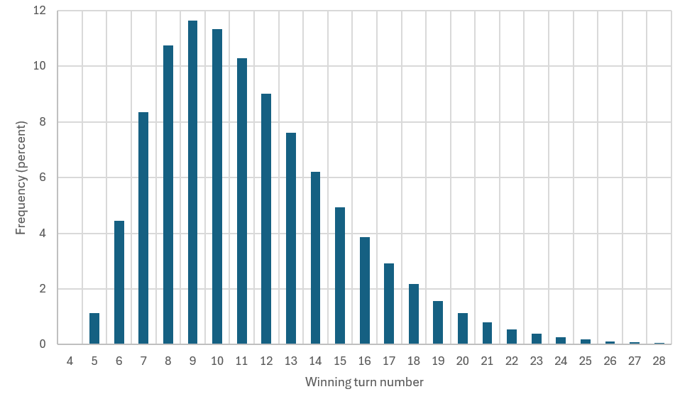

# Duskmourn's Claim

I saw a deck built around Duskmourn's Claim (aka Parker Luck) [on Bluesky](https://bsky.app/profile/mtgcreativecombos.bsky.social/post/3lzzcqxtdlc2k).

The deck kind of plays itself; you just want to get the namesake card in play and hope to make your opponent lose enough life over the subsequent turns to win.

This leads to a natural question: how many turns should it take to win with this deck?
The goal of this simulation is to try to answer that question.

This simulation is very simplistic because trying to code up the whole BO1 Arena metagame with automated optimal decision making for both players is not an easy undertaking (to put it lightly).
To keep this a doable project, we are not simulating the opponent at all; they are a goldfish.
We are only simulating the Duskmourn's Claim and seeing how long it takes to accumulate 20 damage with the namesake card.
This means ignoring things like attacking with creatures, which of course is something you would normally do in a game of Magic.
You could try to justify this choice by saying "we assume the opponent hs blockers", but honestly it's just because I don't want to dump too much time into this.
Maybe in the future I'll do a better job (as I make incremental improvements to `mtg-lib-core`).

## Simulation results

- About 61% of the time, the deck wins between turns 7 and 10 (inclusive).
- The deck wins on turn five 1% of the time and amazingly on turn four 0.03% of the time.
- The deck loses (by running out of cards in library) 0.1% of the time.
- The full distribution: 
- The average is winning on turn 11.38 (+/- 0.01).
- If there is no strategy to scrying/surveiling then this increases to 11.86, or 11.74 if we replace the scry lands with untapped duel lands.
- The mulligan heuristic of trying to have Duskmourn's Claim in the opening hand also makes the deck slower some how, raising the average to 11.57 (assuming we always keep at least 4 cards). I do not understand this result. This is why the current code effectively disables mulligans by always choosing to keep 7 cards.
